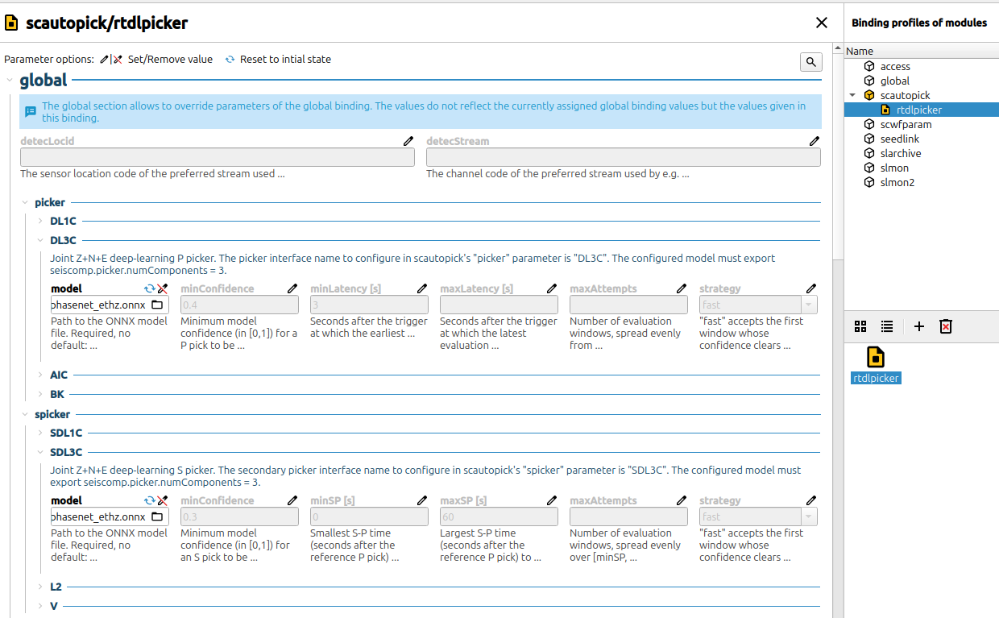

# scdlrtpicker: deep-learning real-time phase picker for SeisComP

`scdlrtpicker` runs deep-learning phase-picking models (PhaseNet,
EQTransformer, EQCCT, or your own) as a native SeisComP **P and S picker**.
A model's weights and architecture are exported once to a portable file, so
this plugin never depends on the framework or language that trained it
(PyTorch, TensorFlow, …).

Currently that format is ONNX (Open Neural Network Exchange), a standard,
framework-neutral model representation every major training framework can
export to; the only runtime requirement is ONNX Runtime, which loads and
runs the `.onnx` file.

It plugs into SeisComP's existing picker framework, so it works today in:

- **`scautopick`**: automatic real-time P and S picks on the continuous
  stream;
- **`scolv`**: interactive re-picking (the *repick* key) using the same
  model.

It is a picker interface like the classical AIC / BK / GFZ P pickers or the
L2 S picker, usable by any module that supports picker plugins, such as
scautopick and scolv. Like those, it is configured through **global
bindings** parameters — the same scope as `picker.AIC.*` etc. — under
`picker.DL3C.*`/`spicker.SDL3C.*`/`picker.DL1C.*`/`spicker.SDL1C.*`. They only
show up in `scconfig` (with their parameter documentation) once the plugin
has been loaded:

```
plugins = ${plugins},dlrtpicker
```



*The `picker`/`spicker` parameters (`model`, `minConfidence`, the window
settings, `strategy`) as they show up in `scconfig`'s Bindings panel, once
this plugin is loaded.*

## Why this design

Deep-learning pickers are normally deployed as a sliding window scanning every
channel continuously.

SeisComP's picker framework already solves the "when to look" problem:

- a **P picker** is invoked by an **STA/LTA detector trigger**. It is handed a
  short waveform window around the trigger and returns a pick time (optionally
  with a confidence and polarity) or nothing.
- an **S picker** is invoked by an existing **P pick**, automatic or manual.
  It looks for S in a window that follows the P.

In this framework a deep-learning model only runs **once per trigger** and
**once per P pick**, never continuously. Set the STA/LTA detector permissively
(a low trigger threshold): the detector just has to not *miss*
real arrivals; precision comes from the deep-learning model, which confirms or
rejects every trigger via its own `minConfidence`. You get deep-learning pick
quality at a small fraction of the cost of continuous inference.

## Picker interfaces

| Interface | `scautopick` slot | Components | Picks | Invoked by |
|-----------|-------------------|------------|-------|------------|
| `DL1C`    | `picker`          | 1          | P     | detector trigger |
| `DL3C`    | `picker`          | 3          | P     | detector trigger |
| `SDL1C`   | `spicker`         | 1          | S     | a P pick |
| `SDL3C`   | `spicker`         | 3          | S     | a P pick |

`DL3C` / `SDL3C` are the usual choice; the 1-component variants are for
single-component stations, assuming you have a single-component model to run
on them.

## Models

The plugin contains no picker logic of its own, but runs whatever ONNX model the
`model` parameter points at, adapting to what the model declares about itself:
how many components it takes (1 or 3) and in which order, its sample rate and
window length, and which phases it predicts (`P`, `S`, or both). All of this
lives **inside the model file** as ONNX `metadata_props`, so switching models is
only a path change. The contract below is the complete list.

### Ready to use

[`models/`](models/) ships 49 pre-exported weight sets, named `<model>_<dataset>.onnx`,
covering every SeisBench architecture the exporter supports: PhaseNet,
PhaseNetLight, EQTransformer, OBSTransformer, EQCCTP, EQCCTS, BasicPhaseAE,
Skynet, EQTP. Each is a single, self-contained file; nothing else to ship
alongside it. `eqtp_ncedc.onnx` additionally exports first-motion polarity.

Inspect what any file actually declares (components, window, phases, rate,
normalization) without touching seisbench/torch:

```sh
python3 models/show_model_info.py models/phasenet_ethz.onnx   # one file, full detail
python3 models/show_model_info.py models/*.onnx               # comparison table
```

[`models/table.txt`](models/table.txt) is a saved snapshot of that comparison table
for the full shipped set, but it can go stale if `models/` changes; re-run the
command above for the current state.

To export more — a newer SeisBench model version, another architecture, or a
model whose sub-phases (e.g. Skynet's `Pn`/`Pg`) need folding into the plain
`P`/`S` this plugin reads:

```sh
cd models
python3 export_seisbench_to_onnx.py --model phasenet --dataset geofon -o phasenet_geofon.onnx
python3 export_seisbench_to_onnx.py --model skynet --dataset original_multiphase \
        --phase-map "P=Pn,Pg S=Sn,Sg" -o skynet_multiphase.onnx
./dump_all_models.sh   # regenerates every file above, or the full current SeisBench roster
```

Read the diagnostics the exporter prints — they check the export against the
contract below and say plainly when a model doesn't fit it (e.g. GPD is a
window classifier, not a per-sample picker, so it is skipped).

### Custom models

An ONNX model of any architecture works if it satisfies all of the following.

**Graph** — exactly one input tensor and one output tensor:

| tensor | shape | |
|--------|-------|--|
| input  | `[1, numComponents, windowLength]` | one waveform window, channel-major |
| output | `[1, numPhases, windowLength]`     | one probability curve per phase, sample-for-sample aligned with the input |

`numPhases` is the number of names in `seiscomp.picker.phases`, and **output
row `i` is the curve for the `i`-th name** in that list. (Only the total element
count is checked, so a leading batch dim of `1` may be dropped.)

**Input the plugin builds** — per trigger, for each component, a
`windowLength`-sample window, then in order:

1. **resampling** to `sampleRate` with a Lanczos FIR filter, so a 100 Hz model
   runs unchanged on 50/200/… Hz stations (skipped when `resample = false`);
2. **per-component normalisation** per `normalization`;
3. placement into input rows per `componentOrder`.

**Components**: `numComponents` is `1` or `3` (2 is rejected):

- `1` → the vertical component only (`DL1C` / `SDL1C`).
- `3` → vertical, then the two horizontals, as SeisComP resolves them from the
  station inventory (`getThreeComponents`: vertical by dip, horizontals by
  azimuth ≈ N then E). **Horizontals are not rotated and carry no imposed
  geographic meaning** — a 3-component model only needs to have been trained on
  three channels in a *consistent* order (true ZNE, arbitrary `1`/`2`
  horizontals, an OBS layout, …). If that order is not
  `[vertical, first-horizontal, second-horizontal]`, declare it with
  `componentOrder`.

**Phases**: `seiscomp.picker.phases`, comma-separated, in output-row order:

- A **P picker** (`DL1C` / `DL3C`) requires a row named exactly `P` (setup fails
  otherwise) and picks the strongest peak of that curve.
- An **S picker** (`SDL1C` / `SDL3C`) requires a row named exactly `S`.
- A model may carry **P only, S only, or both**; a file with both serves both
  slots.
- If a P model also has an `S` row, the P picker uses it for a cross-phase
  check — a P peak is rejected when the S curve there is ≥ 80 % of it. Without
  an `S` row that check is skipped.
- Other rows (`N`, `Detection`, …) are ignored.

**Values**: the peak of the picked curve is compared directly against
`minConfidence` and stored as the pick's `snr` and a `confidence` comment, so
the curves should be probabilities in `[0, 1]`.

**Polarity**: a P model may additionally declare
`seiscomp.picker.polarityLabels` as two names from `phases`, `<up-row>,<down-row>`
(e.g. `Polarity_U,Polarity_D`): rows giving first-motion polarity at the same
sample index as the picked phase. Whichever row is higher at that sample wins,
and the pick's polarity is set only if that value also clears
`polarityMinConfidence`; otherwise it is left unset. S pickers ignore this key,
since `SecondaryPicker::Result` has no polarity field. Without
`polarityLabels`, polarity is always left unset.

**Uncertainty** — either a P or an S model may declare
`seiscomp.picker.uncertaintyLabels` as one or two names from `phases`, e.g.
`P_lower,P_upper` (or a single `P_sigma` for a symmetric value): row(s) giving
the picked phase's time uncertainty in seconds at the same sample index as the
pick. One name is used for both the lower and upper uncertainty. Without
`uncertaintyLabels`, the pick's uncertainty is left unset, unless
`uncertaintyAtMinConfidence`/`uncertaintyAtMaxConfidence` (both P and S) are
configured, which linearly map the pick's own confidence to a derived
uncertainty instead.

### Metadata keys

Set with `onnx.helper.set_model_props()` or your export tooling's equivalent:

| key | default | meaning |
|-----|---------|---------|
| `seiscomp.picker.numComponents` | *required* | `1` or `3` |
| `seiscomp.picker.sampleRate`    | *required* | model input rate, Hz (e.g. `100`) |
| `seiscomp.picker.windowLength`  | *required* | input length in **samples** (e.g. `3001`) |
| `seiscomp.picker.phases`        | *required* | output-row phase names, comma-separated (e.g. `P,S,N`) |
| `seiscomp.picker.normalization` | `std` | `std` (demean, ÷ std, N−1), `peak` (demean, ÷ max\|·\|), or `none` — must match the model's training |
| `seiscomp.picker.componentOrder`| `ZNE` | permutation of the first `numComponents` letters of `ZNE`; only meaningful for 3-component models. `ENZ` → input row 0 ← second horizontal, 1 ← first horizontal, 2 ← vertical |
| `seiscomp.picker.resample`      | `true` | `false` skips resampling for a rate-tolerant model; `sampleRate` is still required — it sets the window *duration* the picker's timing reasons about |
| `seiscomp.picker.polarityLabels`   | *unset* | P side only, `<up-row>,<down-row>` from `phases` (e.g. `Polarity_U,Polarity_D`); unset means the model has no first-motion output |
| `seiscomp.picker.uncertaintyLabels`| *unset* | P and/or S, one or two names from `phases`, values in **seconds** (e.g. `P_lower,P_upper`, or a single `P_sigma`); unset means the model has no per-pick uncertainty output |

---

## Build

Place this repo at `src/extras/scdlrtpicker` in your SeisComP source tree (it
is auto-discovered) and configure SeisComP with the plugin on:

```sh
cmake -DSC_DLRTPICKER=ON \
      -DONNXRUNTIME_ROOT=/path/to/onnxruntime-linux-x64-<version> \
      <your usual SeisComP cmake options>
make dlrtpicker && make install
```

Off by default; with `SC_DLRTPICKER=ON`, ONNX Runtime must be found or
configuration fails.

**The ONNX Runtime version used at run time must match the one linked here.**
`libonnxruntime.so.1` is not rpath'd into the plugin — it must be on the
dynamic linker path (`ldconfig` or `LD_LIBRARY_PATH`) of every process that
loads `dlrtpicker`, and be the *same* release (a mismatch fails with
`version 'VERS_x.y.z' not found`).

A quick way to get it onto the dynamic linker path without touching
`ldconfig`/`LD_LIBRARY_PATH`: download a release from
https://github.com/microsoft/onnxruntime/releases, extract it into
`SEISCOMP_ROOT/lib/`, and symlink the versioned `.so` there (already on
every SeisComP process's linker path):

```sh
cd SEISCOMP_ROOT/lib
tar xf onnxruntime-linux-x64-<version>.tgz
ln -s onnxruntime-linux-x64-<version>/lib/libonnxruntime.so.1 libonnxruntime.so.1
```

## Configure

You can configure the picker's own settings via **global bindings**
parameters (see "Speed vs. quality" above for the window settings), for use
in either scolv or scautopick.

**`model` is required and has no default** — `picker.DL3C.model`/
`spicker.SDL3C.model` (or the `DL1C`/`SDL1C` equivalents) must point at an
`.onnx` file, or `setup()` fails and that picker stays disabled:

```
picker.DL3C.model   = /path/to/phasenet_ethz.onnx
spicker.SDL3C.model = /path/to/phasenet_ethz.onnx
```

For testing, you can skip bindings and apply the same settings to every
station directly in `scautopick.cfg`. Normally this is discouraged, since
this form of configuration isn't visible in `scconfig`:

```
module.trunk.global.picker.DL3C.model   = /path/to/phasenet_ethz.onnx
module.trunk.global.spicker.SDL3C.model = /path/to/phasenet_ethz.onnx
```

### Speed vs. quality: choosing the window

Each time it is invoked, the picker runs the model on a fixed-length window
(the model's own design length) ending a chosen delay after the reference time,
that is the detector trigger for P, the P pick for S. You control **how many**
windows it tries and **where** they sit, and this is the main trade-off:

- **A later window** puts the true onset near its centre, where the model is
  most reliable; **more accurate pick, available later.**
- **An earlier window** is mostly already-buffered pre-trigger data; **pick
  available almost immediately, slightly noisier onset time.**

Two working modes are possible: reliable but higher-latency picks, or fast
picks. Configuration alone drives both, but the underlying model has to
actually support fast picking for that to work well: you can configure the
picker to run a model a second after the trigger, but if the model was
trained on a 30 s window with the pick centred in it, feeding it a window
where the true onset sits right at the edge won't work well.

Here is how to configure it (in global bindings):

#### Reliable picks (analysis, routine monitoring, scolv)

For P, use one window centred on the trigger. The pick is delayed by about half
the model window past its onset:

```
picker.DL3C.maxAttempts = 1     # one window
# picker.DL3C.maxLatency        # unset: defaults to half the model window (centred)
# picker.DL3C.minLatency        # disregarded when maxAttempts is 1
# picker.DL3C.strategy          # not relevant with a single window
```

Or evaluate a few windows and keep the most confident:

```
# picker.DL3C.maxAttempts       # unset: auto count; or select how many windows to compute over [minLatency, maxLatency]
picker.DL3C.minLatency  = 3     # earliest window ends 3 s after the trigger
picker.DL3C.maxLatency  = 30    # latest window ends 30 s after the trigger
picker.DL3C.strategy = best     # evaluate every window, keep the most confident
```

For S a single window is usually not enough: the S picker runs off a P pick and
the S–P time varies with distance, so sweep the S–P range instead:

```
# spicker.SDL3C.maxAttempts     # unset: auto count; or select how many windows to compute over [minSP, maxSP]
spicker.SDL3C.minSP    = 3      # smallest S–P searched
spicker.SDL3C.maxSP    = 45     # largest S–P searched, and the hard reach limit
spicker.SDL3C.strategy = best   # evaluate every window, keep the most confident
```

If the S–P time is predictable and well within the model window, and the model
tolerates an off-centre S, one window is enough:

```
# spicker.SDL3C.maxAttempts     # unset: equal minSP/maxSP already gives one window
spicker.SDL3C.minSP = 12        # minSP == maxSP => one window, centred on S–P = 12 s
spicker.SDL3C.maxSP = 12
# spicker.SDL3C.strategy       # not relevant with a single window
```

#### Fast picks (early warning, fast association)

Start close to the reference and accept the first confident window:

For P, use first window ≈ all pre-trigger buffer:

```
# picker.DL3C.maxAttempts        # unset: auto count; or select how many windows to compute over [minLatency, maxLatency]
picker.DL3C.minLatency = 1       # earliest window ends 1 s after the trigger
picker.DL3C.maxLatency = 8       # stop sweeping 8 s after the trigger
picker.DL3C.strategy = fast      # accept the first window over minConfidence
```

For S, keep the S–P range short:

```
# spicker.SDL3C.maxAttempts       # unset: auto count; or select how many windows to compute over [minSP, maxSP]
spicker.SDL3C.minSP    = 0       # from S–P = 0 ...
spicker.SDL3C.maxSP    = 15      # ... to S–P = 15 s (an S beyond this is not found)
spicker.SDL3C.strategy = fast    # accept the first window over minConfidence
```

The first pick can be emitted with near-zero added latency; later windows are
only used if the early ones are not confident enough.


The rest of this section is scautopick-specific:

### scautopick: Select the pickers

`picker`/`spicker`: set them directly in `scautopick.cfg`:

```
picker  = DL3C   # or DL1C
spicker = SDL3C  # or SDL1C
```

### scautopick: The STA/LTA detector

The DL model only ever sees what the STA/LTA `Detector` triggers on, so the
detector has to be permissive: its job is to not *miss* real arrivals, not to
be precise, because this plugin's `minConfidence` does that.

You can use scautopick's own module configuration for a network-wide default
configuration, without making use of the bindings:

```
filter          = "RMHP(10)->ITAPER(30)->BW_BP(4,5,20)->STALTA(1,30)"
timeCorrection  = 0
thresholds.triggerOn  = 1.8
thresholds.triggerOff = 1.0
killPendingSPickers = false
```

Raise `thresholds.triggerOn`/`thresholds.triggerOff` (or the equivalent
per-station binding parameters `trigOn`/`trigOff`, if you use bindings
instead) if the DL picker is swamped with rejected triggers (harmless but
wasted inference); lower them if it is missing real arrivals the DL model
would have confirmed.

`killPendingSPickers` (default `true`) removes a still-running secondary picker
from an earlier pick on the same stream once a new P pick arrives, if that older
picker's own search window has already elapsed. Set to `false`, as above, to 
keep both picks instead.

### scautopick: Dead time

Once an arrival has triggered a pick, its own coda shouldn't
trigger a *second* one. The coda is still the same arrival and the DL model
already evaluated it, so a new `DLPicker` spawned on it is both wasted
inference and a spurious duplicate pick. This matters more here than with
a classical picker: the low `thresholds.triggerOn`/`triggerOff` needed to
not miss real arrivals also makes the coda itself more likely to
re-trigger in the first place.

`deadTime`/`minAmplOffset` decide whether a detector trigger on the coda
actually spawns a `DLPicker` at all. Once a pick exists on a stream, a later
trigger candidate is accepted or discarded as soon as the STA/LTA ratio falls
back below `triggerOff` *or* `amplMaxTimeWindow` runs out, whichever happens first,
and only accepted if its own measured amplitude (the peak over that same interval,
not its value at the instant it crossed `triggerOn`) clears a bar:

```
minAmplitude = minAmplOffset + lastPickAmplitude · exp(-(dt/deadTime)²)
```

`dt` is the time since the last accepted pick; `lastPickAmplitude` is
whichever candidate's peak was most recently measured, accepted or not. The
bar keeps dropping continuously, and a new candidate only gets through once
*its own* measured peak exceeds whatever the bar is at that moment. Right at
`dt = 0` the bar is `minAmplOffset + lastPickAmplitude`, and since any
measured peak is at least `triggerOn` (that's what crossed the threshold to
begin with) and `minAmplOffset ≈ triggerOn`, the bar starts at **at least
about twice `triggerOn`** — more still if the original arrival was large.
By `dt = deadTime` about a third of that bonus is left; by `dt = 2 × deadTime`
it's under 2%, leaving just the flat `minAmplOffset` floor. So `minAmplOffset`
should simply match `triggerOn`.

**Rule of thumb:**

```
thresholds.deadTime      = ?     # set equal to picker.DL3C.maxLatency
thresholds.minAmplOffset = 1.8   # set equal to thresholds.triggerOn above
```

**`amplMaxTimeWindow`**: A trigger normally ends (`triggerOff`) well before
`amplMaxTimeWindow` runs out, so the pick peak amplitude is finalized right
at `triggerOff` and the decision to emit the trigger or not. But if an
excursion outlasts `amplMaxTimeWindow`, which is plausible here, since the
low `triggerOff` this plugin needs keeps the STA/LTA ratio elevated longer
than under classical settings, the amplitude gets finalized *before* `triggerOff`,
checked against a bar that was computed from `dt` at the trigger's own crossing
instant and never updated for the extra time spent still measuring.
**Keep `amplMaxTimeWindow` comfortably below `deadTime`** (a fraction of it, not
close to or above it) so that mismatch stays small enough to not matter.

### Buffer sizing

`ringBufferSize` / `leadTime` (module-level) must cover the picker's widest
requested window, not just the classical filter's warm-up. The defaults
(300 s / 60 s) are fine for phasenet/eqtransformer-scale (<~60 s) models; a
long-window model needs both raised to comfortably exceed its window
duration.

## What ends up on the pick

Pick time, phase hint and method ID (`DL1C` … `SDL3C`) as for any picker. The
model confidence is carried in the pick's `snr` field **and** added as a
`confidence` comment as a 0–1 value, not a classical signal-to-noise ratio.

If the model declares `seiscomp.picker.polarityLabels` (P side only), the
pick's polarity is set as well, alongside a `polarity_confidence` comment; if
it declares `seiscomp.picker.uncertaintyLabels` (P and/or S), the pick's time
lower/upper uncertainty are set. Both are left unset when the model doesn't
declare the corresponding key — see "Polarity"/"Uncertainty" above.

